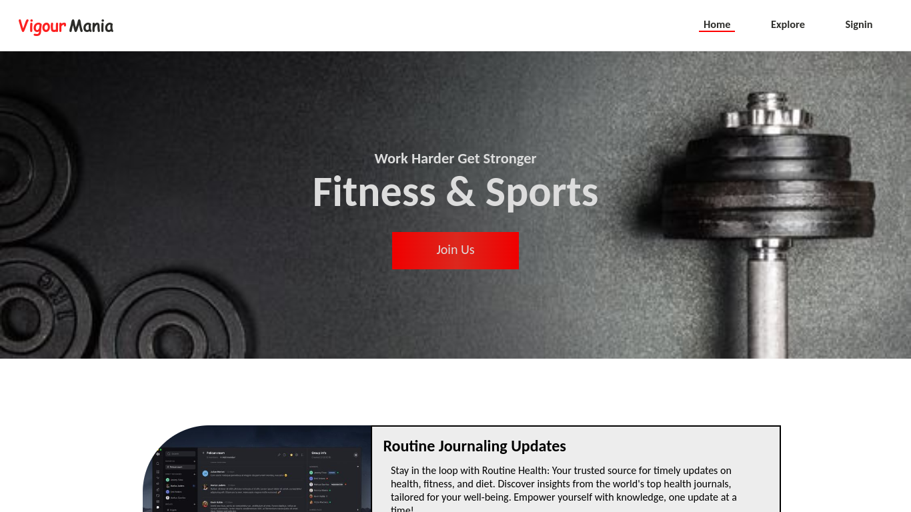
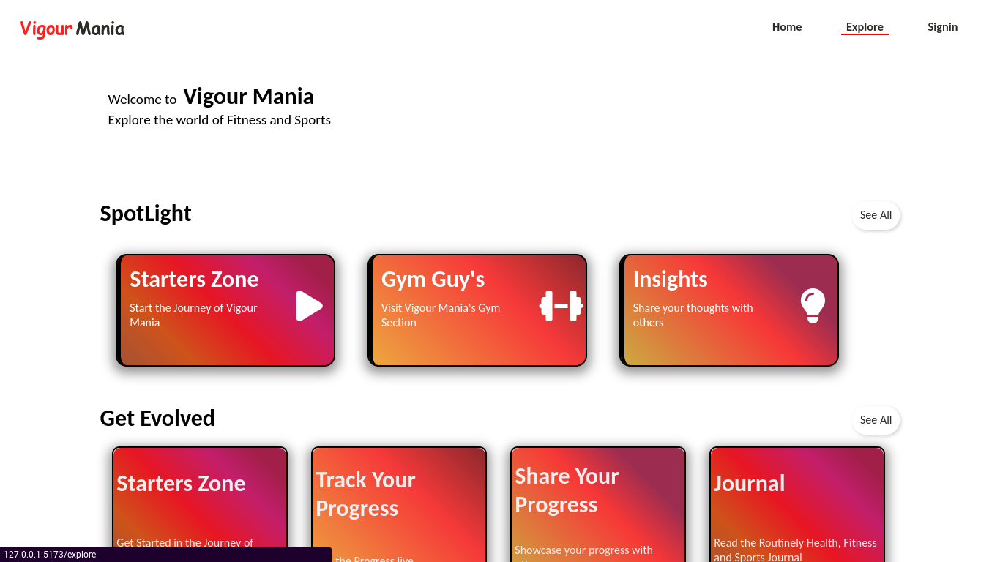
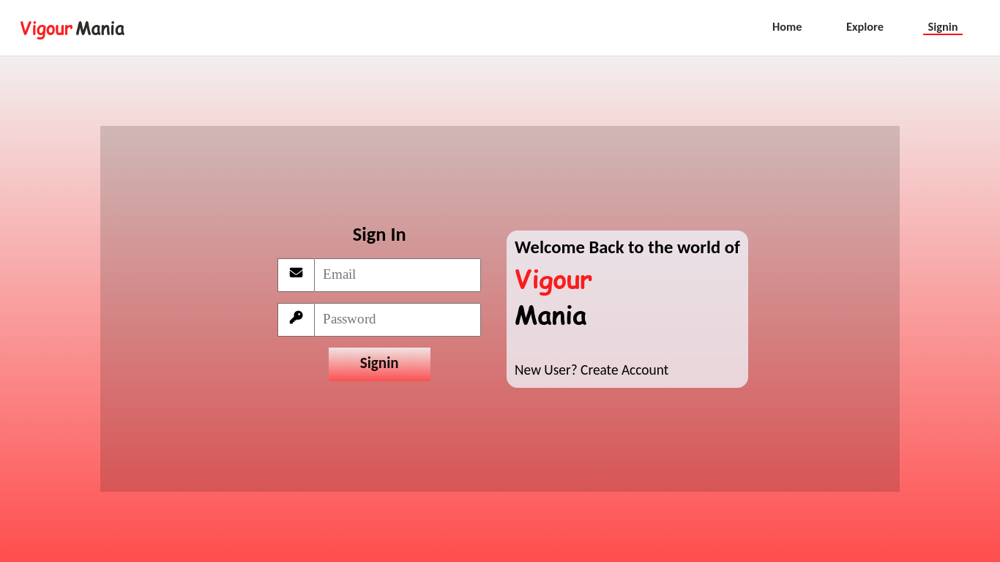

<h1 align="center">Vigour Mania</h1>

Vigour Mania is a web app helping to visualise and track user fitness activities based on data provided by user and contains weekly journals to keep users updated in the field of health and fitness, with a service of commenting and create personalised notes.
<h2>Technologies Used</h2>

<ul>
<li>HTML/CSS/JavaScript</li>
</ul><ul>
</ul><ul>
<li>React</li>
</ul><ul>
<li>NodeJS</li>
</ul><ul>
<li>ExpressJS</li>
</ul><ul>
<li>MongoDB</li>
</ul><ul>
<li>Recharts</li>
</ul><ul>
<li>JSON Web Tokens (JWT)</li>
</ul><ul>
<li>BcryptJS</li>
</ul><ul>
<li>And many other npm packages</li>
</ul><h2>Features</h2>

<ul>
<li>The web application has commenting system in the Journals Section.</li>
</ul><ul>
<li>It contains a notes section to allow user to have a personalised notebook.</li>
</ul><ul>
<li>There has been applied light and dark themes, so that user can use the app with convinience.</li>
</ul><ul>
<li>When it comes to the backend JSON Web Tokens are being used for user authentication, which results in secure data fetching.</li>
</ul><ul>
<li>It uses BcryptJS to hash the passwords so that there could be some prevention to malicious activities.</li>
</ul><ul>
<li>The application allows user to have user profile presenting user's data.</li>
</ul><h2>Screenshots</h2>

<h2>Setup</h2>

The project is mainly based on MERN Stack Development.Where it uses Vite to run the Front-End Part smoothly.

In the back-end it uses Node.js with Express.js to create a RESTful API that can handle CRUD operations as requested by the Front-End.
<h2>Usage</h2>

SomeOne can use the app to track his fitness data and can read the journals that give the information regarding health.

For Example: A person can use the app to track the     time required to run 400m periodically and update in the application.
<h2>Project Status</h2>

In Progress

The project is In Progress as, new features would be added continously after obtaining new ideas.
<h2>Contact</h2>

=======
<h1 align="center" >Vigour Mania</h1>

  Fitness Data Visualizer  
Vigour Mania is a web app helping to track user fitness activities based on data provided by user and contains weekly journals to keep users updated in the field of health and fitness, with a service of commenting.The web app  shows the user web  profile and allows user to make notes for future reference.

>>>>>>> bd80d14365e0f5640ae24a6d6bee63e2e2bc224d
